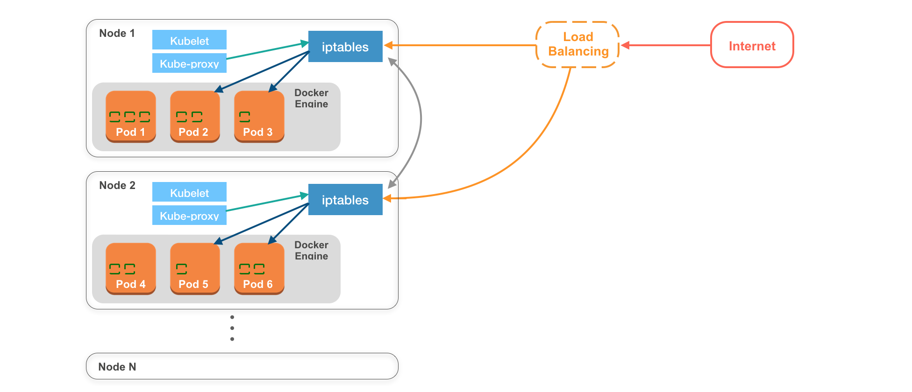
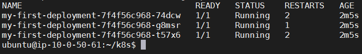
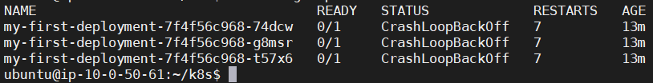

# AWS EC2

env : ubuntu 18.04

# Install kubectl on Linux
https://kubernetes.io/docs/tasks/tools/install-kubectl/

```sh
# Download the latest release with the command:
curl -LO https://storage.googleapis.com/kubernetes-release/release/`curl -s https://storage.googleapis.com/kubernetes-release/release/stable.txt`/bin/linux/amd64/kubectl

chmod +x ./kubectl 

sudo mv ./kubectl /usr/local/bin/kubectl

kubectl version --client
```

# Install Minikube
https://kubernetes.io/docs/tasks/tools/install-minikube/


Minikube also supports a `--driver=none` option that runs the Kubernetes components on the host and not in a VM. 
Using this driver requires Docker and a Linux environment but not a hypervisor.

```sh
curl -Lo minikube https://storage.googleapis.com/minikube/releases/latest/minikube-linux-amd64 && chmod +x minikube
sudo mkdir -p /usr/local/bin/
sudo install minikube /usr/local/bin/

# --driver='': Driver is one of: virtualbox, parallels, vmwarefusion, kvm2, vmware, none, docker, podman (experimental) (defaults to auto-detect)
minikube start

# (Wait Installing...)

# If your cluster is running, the output from minikube status should be similar to:
minikube status

# (optional) To stop your cluster, run:  
minikube stop

# 如果 k8s 要全部重新來過, 可以下刪除指令
minikube delete

# 刪除一開始下載的
sudo rm minikube
```

啟動 minikube 之後，會發現 HOME 目錄底多了一個 .kube 的資料夾，  
而 kubectl 就是透過該資料夾底下的 configuration 與 minikube 溝通，  
可以用 cat 指令查看 ~/.kube/config 的內容  


```sh
# start the pod running nginx
kubectl run --image=nginx nginx-app --port=80 --env="DOMAIN=cluster"

# expose a port through with a service
kubectl expose deployment nginx-app --port=8080 --name=nginx-http
```

# Trobule issue #1

這邊操作 `run` 後發生一件超奇怪的事情  
正常來說，run 後應該會自帶 `--restart='Always'`，然後自動產生 `deployment`  
我的狀況沒有產生 deployment，只有 pod  
但如果使用 create, apply 的方式執行，是可以產生 deployment  


```sh
# 使用 create 
kubectl create deployment nginx-app --image=nginx

# 使用 apply
kubectl apply -f https://k8s.io/examples/application/deployment.yaml
```

# 常用的 kubectl 指令

```sh
kubectl get all                                            # 取得所有資訊
kubectl get pods                                           # List pods
kubectl get deployments                                    # List deployments
kubectl delete deployment [deployment-name]                # Delete a deployment
kubectl describe pod <pod>                                 # 取得某一個 Pod 的詳細資料
kubectl port-forward <pod> <external-port>:<pod-port>      # 將某一 Pod 中指定的 port number mapping 到本機端的某一特定 port number
kubectl exec <pod> -- <command>                            # 可以對 Pod 下一個內部指令
kubectl exec -it <pod> -- sh                               # 進入 pod
kubectl label pods <pod> <label-key>=<label-value>         # 新增 Pod 的 Labels
kubectl get pod --show-labels                              # 查看目前 my-pod 有哪些 labels
```


注意：如果使用 `Minilube`，就不会有外部 IP 地址。外部 IP 地址将会一直是 pending 状态。


啟用 nginx 服務只需要下面這三行即可
```sh
kubectl apply -f https://k8s.io/examples/application/deployment.yaml

# 讓本機端可以連到 nginx-deployment 這個服務
kubectl expose deployment nginx-deployment --type=NodePort

# 取得 service 的 url
minikube service nginx-deployment --url

# 之後再透過主機 nginx 設定反向代理, 將 host ip:port 指向 k8s service ip:port
```

# 做一個 node 環境的 dockerfile

```
mkdir node-demo
cd node-demo
```

Dockerfile
```
FROM node:13.12.0-alpine
WORKDIR /app
ADD . /app
RUN npm install
EXPOSE 3000
CMD npm start
```

index.js
```js
var express = require('express');
var app = express();
app.get('/', function(req, res) {
  res.send('Hello World!');
});
var server = app.listen(3000, function() {
  var host = server.address().address;
  var port = server.address().port;
  
  console.log("Example app listening at 'http://%s:%s'", host, port);
})
```

package.json
```json
{
  "name": "myapp",
  "version": "1.0.0",
  "scripts": {
    "start": "node index.js"
  },
  "dependencies": {
    "express": "^4.16.2"
  }
}
```

```sh
ubuntu@ip-10-0-50-61:~/k8s/node-demo$ ls
Dockerfile  index.js  package.json
```

```sh
docker build -t scottchayaa/node-demo .         # build 完成後直接壓上 tag (建議)
docker build .
docker tag 827c598f178d scottchayaa/node-demo   # build 完事後改 tag
docker image ls                                 # 查看你的 image 的 id

docker login

docker push scottchayaa/node-demo

docker run -it -p 3000:3000 scottchayaa/node-demo # 本機 run node 環境
```

# Run your docker on kubernates, use pod

my-first-pod.yaml
```yaml
apiVersion: v1
kind: Pod
metadata:
  name: node-demo
  labels:
    app: node-demo  # 這個很重要
spec:
  containers:
  - name: node-demo
    image: scottchayaa/node-demo
    ports:
    - containerPort: 3000

# 至於為什麼要這樣設定，可以參考 kubernetes docs (v1.18) : Pod v1 core 章節
# https://kubernetes.io/docs/reference/generated/kubernetes-api/v1.18/#pod-v1-core
```

```sh
kubectl create -f my-first-pod.yaml
kubectl get pods
kubectl describe pods node-demo

# 建立一個 Service 與 pod 互動
kubectl expose pod node-demo1 --type=NodePort --name=my-pod-service # 隨機配一個對外 port
kubectl get services
minikube service my-pod-service --url

```

如果不想使用 expose, 也可以使用 template 方式建立 service

my-first-service.yaml
```yaml
kind: Service
apiVersion: v1
metadata:
  name: my-first-service
spec:
  selector:
    app: node-demo   # 尋找 pods 裡面 label 標籤有包含此設定值的字串. 可以先用 kubectl describe pod [pod-name] 查看 pod 裡面的資訊
  ports:
  - name: http
    port: 3000
    nodePort: 30001
  type: NodePort
```

```sh
kubectl create -f my-first-service.yaml

kubectl delete service my-pod-service
```

# kubenetes overview




# Replication Controller

Replication Controller 就是Kubernetes上用來管理Pod的數量以及狀態的controller，  
我們可以用 Replication Controller 在Kubernetes上做到以下幾件事：

- 每個Replication Controller都有屬於自己的 yaml 檔
- 在Replication Controller設定檔中可以指定同時有多少個相同的Pods運行在Kubernetes Cluster上
- 當某一Pod發生crash, failed，而終止運行時，Replication Controller會幫我們自動偵測，並且自動創建一個新的Pod，確保Pod運行的數量與設定檔的指定的數量相同
- 當機器重新開啟時，之前在機器上運行的 Replication Controller 會自動被建立，確保pod隨時都在運行。


my-first-replication-controller.yaml
```yaml
apiVersion: v1
kind: ReplicationController
metadata:
  name: my-first-replication-controller
spec:
  replicas: 3
  selector:
    app: node-demo
  template:
    metadata:
      labels:
        app: node-demo
    spec:
      containers:
      - name: node-demo
        image: scottchayaa/node-demo
        ports:
        - containerPort: 3000
```

```sh
kubectl get rc

kubectl get pods

kubectl scale --replicas=4 -f ./my-first-replication-controller.yaml # 手動擴充 pod 數量 3 -> 4
kubectl get rc

kubectl delete rc my-first-replication-controller # 刪除 replication controller
kubectl delete rc my-first-replication-controller --cascade=false # 刪除 replication controller後, pod 保留運行
```

雖然replication controller看似能幫我們解決很多問題，  
但在實務上，應用服務(application)常會遇到rollout以及rollback的情形，  
若只是使用 Replication Controller 免不了需要許多手動的部分。

接下來會介紹 Deployment 機制，   
Deployment 不只減少需要我們手動操作的部分，  
甚至讓應用服務rollout與rollback也變得簡單許多。


 - 系統升級(Rollout) & 回滾(Rollback)  
回溯 DevOps 的歷史，可以發現 DevOps 與 Agile敏捷開發 可以說是密不可分  
在 Agile 社群中其中一個精神便是如何正確收集到使用者需求以及快速的回應，頻繁的系統升級(Rollout)更是不可避免的。  
而對於運維人員，如何在頻繁更新一個服務時做到每次都能zero downtime(無停機服務遷移)更是一大挑戰。  
幸好，這些 Kubernetes 都幫我們做好了。  


# Replica Set
Replica Sets 可以說是進化版的 Replication Controller，  
與 Replication Controller最大的差異在於，Replica Sets 提供了更彈性的selector。

```yaml
# Deployment 取代, 這可以先不用 run
apiVersion: apps/v1
kind: ReplicaSet
metadata:
  name: my-first-replica-set
spec:
  replicas: 3
  selector:
    matchLabels:
      env: dev
    matchExpressions:
      - {key: env, operator: In, values: [dev]}
      - {key: env, operator: NotIn, values: [prod]}
  template:
    metadata:
      labels:
        app: node-demo
        env: dev
        version: v1
    spec:
      containers:
      - name: node-demo
        image: scottchayaa/node-demo
        ports:
        - containerPort: 3000
```

不同於 Replication Controller 的 selector，只能用`等於`的符號表示，R
eplica Set 的 selector 支援更多複雜的條件過濾。

- spec.selector.matchLabels  
在 Replica Set的selector裡面提供了matchLabels，  
matchLabels的用法代表著等於(equivalent)，  
代表Pod的labels必須與matchLabels中指定的值相同，才算符合條件。  

- spec.selector.matchExpressions  
而matchExpressions的用法較為彈性，每一筆條件主要由三個部分組成key, operator，value。  
以 my-replica-sets.yaml 中敘述為例，我們指定Pod的條件為 1) env必須為dev 2) env不能為prod。  
而目前operator支援4種條件In, NotIn, Exists, 以及 DoesNotExis，  
更多關於matchExpressions的運用可以參考 [官方文件](https://kubernetes.io/docs/concepts/overview/working-with-objects/labels/)

而在 Kubernetes官方文件 中也提到，雖然Replica Set提供更彈性的selector，
並不推薦開發者直接使用kubectl create等指令創建Replica Set 物件，
而是透過 `Deployment` 來創建新的 Replica Set。


# Deployment

Deployment 可以幫我們達成以下幾件事情：
- 部署一個應用服務(application)
- 協助 applications 升級到某個特定版本
- 服務升級過程中做到無停機服務遷移(zero downtime deployment)
- 可以Rollback到先前版本


my-first-deployment.yaml
```yaml
apiVersion: apps/v1
kind: Deployment
metadata:
  name: my-first-deployment
spec:
  replicas: 3
  selector:
    matchLabels:
      app: my-deployment
  template:
    metadata:
      labels:
        app: my-deployment
    spec:
      containers:
      - name: my-pod
        image: scottchayaa/node-demo
        ports:
        - containerPort: 3000
```

```sh
kubectl create -f ./my-first-deployment.yaml

kubectl get deployments
kubectl get rs

kubectl get pods --show-labels
```

可以發現 Deployment 已自動幫我們創建Pod，且這個Pod都帶有 `app=my-deployment` 的label，  
而在同時，Deployment也會自動幫我們建立一個 Replication Set 來管理這些 Pod


```sh
# Deployment 相關指令 
kubectl get deployments	                                                          # 取得目前Kubernetes中的deployments的資訊
kubectl get rs	                                                                  # 取得目前Kubernetes中的Replication Set的資訊
kubectl describe deploy <deployment-name>                                         # 取得特定deployment的詳細資料	
kubectl set image deploy/ <deployment-name> <pod-name>: <image-path>: <version>   # 將deployment管理的pod升級到特定image版本	
kubectl edit deploy <deployment-name>                                             # 編輯特定deployment物件	
kubectl rollout status deploy <deployment-name>                                   # 查詢目前某deployment升級狀況	
kubectl rollout history deploy <deployment-name>                                  # 查詢目前某deployment升級的歷史紀錄	
kubectl rollout undo deploy <deployment-name>                                     # 回滾Pod到先前一個版本	
kubectl rollout undo deploy <deployment-name> --to-revision=n                     # 回滾Pod到某個特定版本
```

```sh
kubectl expose deploy my-first-deployment --type=NodePort --name=my-deployment-service

minikube service my-deployment-service --url

curl http://172.17.0.2:31548
Hello World!  # 還沒升級前

# 升級 pod
kubectl set image deploy/my-first-deployment my-pod=scottchayaa/node-demo:1.0 --record
kubectl rollout status deploy my-first-deployment

curl http://172.17.0.2:31548 
Hello World! 1.0  # 升級成功

# 檢查更新紀錄
kubectl rollout history deploy my-first-deployment

kubectl set image deploy/my-first-deployment my-pod=scottchayaa/node-demo --record

# rollback回到特定版本
kubectl rollout undo deploy my-first-deployment --to-revision=3
kubectl rollout undo deploy my-first-deployment --to-revision=4

# restart 目前版本, head resource 為 latest 時特別需要 !
kubectl rollout restart deployment my-first-deployment
```


```sh
# rollout 指令 (除了 pause 和 resume 其他很常使用)
kubectl rollout -h

Examples:
  # Rollback to the previous deployment
  kubectl rollout undo deployment/abc

  # Check the rollout status of a daemonset
  kubectl rollout status daemonset/foo

Available Commands:
  history     View rollout history
  pause       Mark the provided resource as paused
  restart     Restart a resource
  resume      Resume a paused resource
  status      Show the status of the rollout
  undo        Undo a previous rollout

```

# 建立外部服務與Pods的溝通管道 - Services

什麼是 Service，如上述前言所提到，我們需要在 Pod 前面再接一層橋樑，  
確保每次存取應用程式服務時，都能連結到正在運行的Pod。若是還記得，  
我們前幾天常使用的指令kubectl expose，就會知道該指令可以幫我們創建一個  
新的 Service 物件，來讓Kubernetes Cluster中運行的 Pod與外部互相溝通。

my-first-service.yaml
```yaml
apiVersion: v1
kind: Service
metadata:
  name: my-first-service
spec:
  type: NodePort
  ports:
  - port: 3000
    targetPort: 3000
    nodePort: 30001
  selector:
    app: my-deployment
```

### nodePort、port、targetPort 的區別

nodePort : 當 type = NodePort 時, 此設定值會有用, 是讓外部流量訪問 service 內的 pods 的設定方式

port : 讓其他 pods 透過這個 port 值, 找到這個 service 內的 pods 服務

targetPort : 對應到內部 pods 的端口, ex : 內部 nginx port 80 . 另外, 若 tagetPort 沒有設定, 則會拿 port 來作為 targetPort

參考 : 
 - https://blog.csdn.net/yjk13703623757/article/details/79819415
 - https://zhuanlan.zhihu.com/p/54753738


```sh
kubectl get pods --show-labels

kubectl create -f my-first-service.yaml

kubectl delete service my-first-service

# 每次重啟 service, cluster ip 都會不一樣
kubectl delete svc/my-first-service && kubectl create -f ./my-first-service.yaml
kubectl get svc
```

- spec.type
可以指定Service的型別，可以是NodePort或是LoadBalancer

- spec.ports.protocol
目前 Service 支援TCP與UDP兩種protocl，預設為TCP

- spec.selector
selector則會幫我們過濾，在範例中，我們創建的Service會將特定的port number收到的流量導向 標籤為`app=my-deployment`的 Pods


# Kubernates : Labels

簡單來說，Labels就是一對具`有辨識度的 key/value`。以下面為例：

- "release" : "stable"，"release" : "qa"
- "enviroment": "dev"，"enviroment": "production"
- "tier": "backend", "tier": "frontend"

Labels 有以下幾個特點：

- 每個物件可以同時擁有許多個labels(multiple labels)
- 可以透過 `Selector`，幫我們縮小要尋找的物件。
- 目前 API 提供不再只是一個 key對應一個value(Equality-based requirement)的關係，我們也可以使用 matchExpressions 來設定更有彈性的Labels。

如果是沒有識別用途的標籤，Kubernetes 也提供了我們一個 `Annotations` 元件。
以 Pod 為例，我們可以在Pod的 `Annotations` 紀錄該 Pod的`發行時間`、`發行版本`、`聯絡人email`等。

example : my-pod.yaml
```yaml
apiVersion: v1
kind: Pod
metadata:
  name: my-pod
  labels:
    app: web
    tier: backend
  annotations:
    version: latest
    release_date: 2020/03/28
    contact: mmx112945@gmail.com
spec:
  containers:
  - name: pod-demo
    image: scottchayaa/node-demo
    ports:
    - containerPort: 3000
  nodeSelector: # 篩選有無符合的 node label 條件
    hardware: highmemory
```

- spec.nodeSelector
會發現目前my-pod的狀態一直在Pending的狀態，如果在用 kubectl describe 仔細查看會發現錯誤的原因是因為沒有找到符合的 Node label
```
kubectl describe pod my-pod
```
如果我們動態新增一個label到目前的 minikube node 上，pending 就會變成 Running
```
kubectl label node minikube hardware=high-memory
```
再次用 kubectl describe 查看 my-pod 的狀態，可以看到更詳細的部署過程

可以試著設想，若是有兩種不同類型的 Pod ，一個需要高量的memory，另外一個是需要高量的CPU。  
透過 nodeSelector 與 labels，我們可以將這些不同種類型的 Pod 部署在不同類型的 Node，讓資源能更有效被利用。

```sh
kubectl create -f ./my-pod.yaml
kubectl describe pods my-pod

# 手動新增 label
kubectl label pods my-pod env=production
kubectl get pods my-pod --show-labels
```


# Deployment => Health check

偵測到 Pod 的生命週期去調整 Kubernetes Cluster 中其他物件的狀態。
有些時候，雖然 Pod 還在運行，但在 Pod 中的 web app container 可能`因為某些原因已經停止運作`
或是資源被其他 containers 佔用，導致我們送去的 request 無法正常回應
幸好，Kubernetes 也幫我們想到這點了，它提供 `Health Checks` 協助我們
去偵測 Pod 中的 containers 是否都還正常運作，確保服務本身也能正常運行。

my-first-deployment-with-health-check.yaml
```yaml
apiVersion: apps/v1
kind: Deployment
metadata:
  name: my-first-deployment
spec:
  replicas: 3
  selector:
    matchLabels:
      app: my-deployment
  template:
    metadata:
      labels:
        app: my-deployment
    spec:
      containers:
      - name: my-pod
        image: scottchayaa/node-demo
        ports:
        - name : webapp-port
          containerPort: 3000
        livenessProbe:
          httpGet:
            path: /                      # health checks 要訪問的路徑
            port: 3000                   # 指定我們要訪問的 port，這裡 port number 是 3000
          initialDelaySeconds: 15        # 設定當 service 剛啟動時，要延遲幾秒再開始做 health check
          periodSeconds: 15              # 代表每隔幾秒訪問一次，預設值為 10秒
          timeoutSeconds: 30
          successThreshold: 1            # 可以設置訪問幾次就代表目前 service 還正常運行
          failureThreshold: 3            # 代表 service 回傳不如預期時，在 Kubernetes 放棄該 container 之前，會嘗試的次數，預設為3次。
```

```
kubectl describe pod my-first-deployment-67975df96f-rvtcn
```

如果 livenessProbe.httpGet 故意設定錯誤
pod 會開始出現 restarts 次數




參考 : https://kubernetes.io/zh/docs/tasks/configure-pod-container/configure-liveness-readiness-startup-probes/


# 敏感資料怎麼存放在 k8s : Secrets

Secrets 協助開發者將一些敏感資訊，像是`資料庫帳密`、訪問其他 server 的 `Access Token`、`SSH Key`，
用非明碼的方式 (opaque) 存放在 Kubernetes 中。今天的學習筆記內容如下：

- 介紹什麼是 Secret
- 實作：Kubernetes 中如何創建 Secret 物件
- 實作：如何掛載 Secret 物件到 Pods 中


在 Kubernetes 存取敏感資料(sensitive data)有以下幾種常見的使用方式：

- 將 Secrets 當成 環境變數(environment variables) 使用
- 將 Secrets File 掛載 (mount) 在 Pod 某個檔案路徑底下使用
- 將這些 sensitive data 統一存放在某一個 Docker Image 中，並將這個 Image 存放在`私有的 Image Registry` 中，透過 image pull 下載到 Kubernetes Cluster 中，讓其他 Pods 存取。 (尚未實作)


可直接進行應用實戰 : [使用 Kubernetes 架設 Wordpress (搭配使用 Secrets)](./02_wordpress.md)

