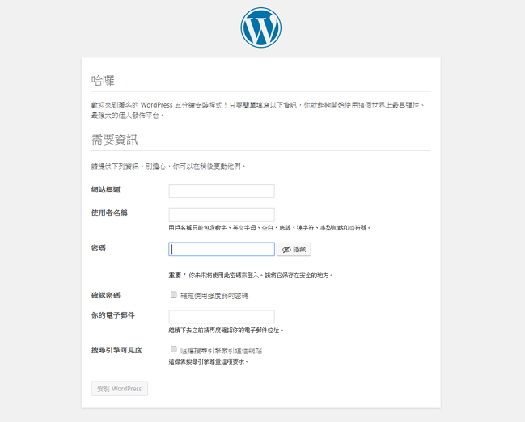

# 使用 Kubernetes 架設 Wordpress (搭配使用 Secrets)

- Docker 
  - [Wordpress](https://hub.docker.com/_/wordpress)
  - [Mysql](https://hub.docker.com/_/mysql)


wordpress-secret.yaml 
```yml
apiVersion: v1
kind: Secret
metadata:
  name: wordpress-secret
type: Opaque
data:
  # echo -n "rootpass" | base64
  db-password: cm9vdHBhc3M=
```


```sh
kubectl create -f ./wordpress-secret.yaml
kubectl get secret
```


my-wordpress-deploy.yaml 
```yml
apiVersion: apps/v1
kind: Deployment
metadata:
  name: wordpress-app
spec:
  replicas: 1
  selector:
    matchLabels:
      app: wordpress-deployment
  template:
    metadata:
      labels:
        app: wordpress-deployment
    spec:
      containers:
      - name: wordpress
        image: wordpress:5.3.2-php7.2-fpm-alpine
        ports:
        - name: wordpress-port
          containerPort: 80
        env:
        - name: WORDPRESS_DB_PASSWORD
          valueFrom:
            secretKeyRef:
              name: wordpress-secret
              key: db-password
        - name: WORDPRESS_DB_HOST
          value: 127.0.0.1
      - name: mysql
        image: mysql:5.7
        ports:
        - name: mysql-port
          containerPort: 3306
        env:
        - name: MYSQL_ROOT_PASSWORD
          valueFrom:
            secretKeyRef:
              name: wordpress-secret
              key: db-password
```

使用剛剛建立的 Secret  
將 db-password 設定到 wordpress 和 mysql  


然後配置 service，將 wordpress 80 port 對應出來 30300

my-wordpress-service.yaml
```yaml
apiVersion: v1
kind: Service
metadata:
  name: wordpress-service
spec:
  ports:
  - port: 80
    nodePort: 30300
    protocol: TCP
    targetPort: wordpress-port
  selector:
    app: wordpress-deployment
  type: NodePort
```


```sh
kubectl create -f ./my-wordpress-deploy.yaml

kubectl create -f ./my-wordpress-service.yaml

minikube service wordpress-service --url
```

然後你會得到像這樣的內部 wordpress 網址
http://172.17.0.2:30300


接下來你可以透過 nginx 設定反向代理設定方式  
將你的 domain 轉送到你指定的內部 ip:port  

```conf
server {
  listen 80;

  server_name wordpress.scottchayaa.com;

  location / {
    proxy_set_header Host $host;
    proxy_set_header X-Real-IP $remote_addr;
    proxy_set_header X-Forwarded-For $proxy_add_x_forwarded_for;
    proxy_pass http://172.17.0.2:30300;
  }
}
```

最後 url 輸入  
http://wordpress.scottchayaa.com

就可以導向到你 k8s 部屬好的 wordpress 網站了





以上，只是`基本練習`  
由於 MySQL 的資料都是存在 container 中，若是 Pod 不小心 crash 或是其他因素遭刪除  
或是主機當掉導致資料遺失  
那表示這個服務的可靠性極低  
所以接下來要說明還有哪些機制可以補強  
讓我們的 Wordpress 網站不會因為突發的狀況而導致服務中斷  


